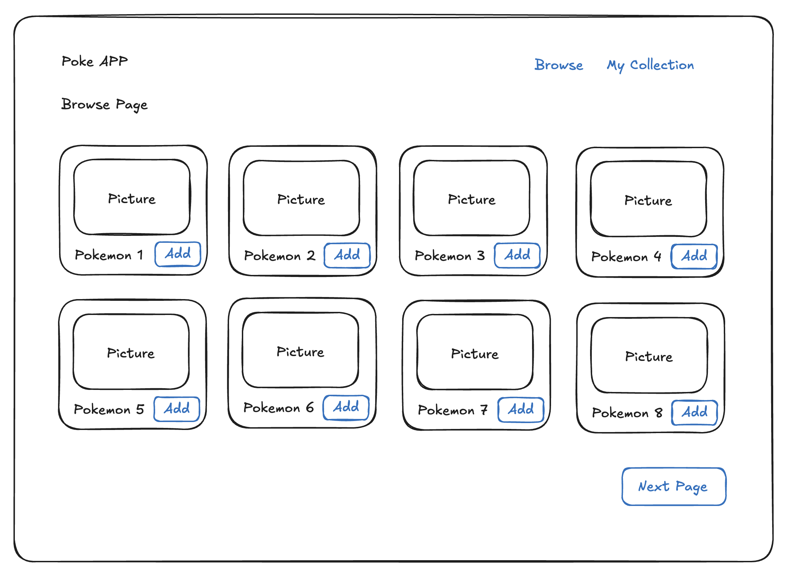
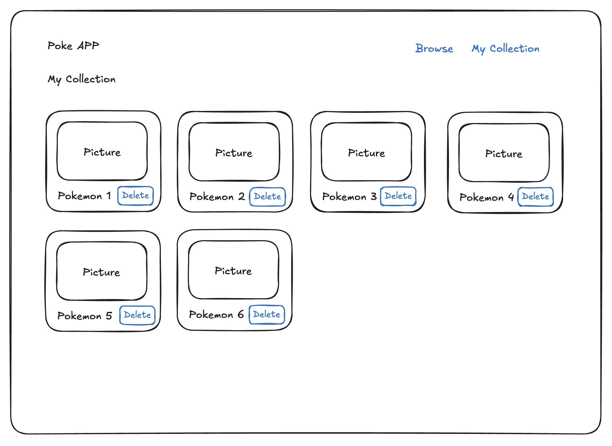

# OKTee Test

We are building a Pokemon collection app!

The app consists of two pages: Browse and My Collection.

## Features

### Browse Page

**Objective:**  
The Browse Page will list all the existing Pokemons.

**Key Features:**

- Display a paginated list of Pokemons
- Ability to add a Pokemon to your collection

### My Collection Page

**Objective:**  
The My Collection Page is where users can see all the Pokemon they have added to their collection.

**Key Features:**

- Display a list of Pokemons in your collection
- Ability to remove a Pokemon from your collection

## Instructions

- NextJS, TypeScript and Postgresql are mandatory, the rest is up to you!
- A docker-compose file with a postgres container is included in the project, feel free to use it !
  You can also use your preferred method to set up the database.
- The collection of Pokemon should be saved in the database.
- The `pokenode-ts` library to interact with the PokeAPI is already included in the project, but
  feel free to use whatever method you prefer to fetch the data.
- The documentation for this library can be found [here](https://pokenode-ts.vercel.app/).
- You should use the `listPokemons` method for the search page

### Bonus points

- Create an intuitive and user-friendly interface for exploring and collecting Pokemon.
- Implement responsive design to ensure optimal viewing on all devices.
- Write some tests to ensure the functionality of the app.

**Setup Instructions:**

1. Clone the repository.
2. Install dependencies using `npm install`.
3. Start the application with the command `npm start`.
4. Open `http://localhost:3000` in your browser to use the app.
